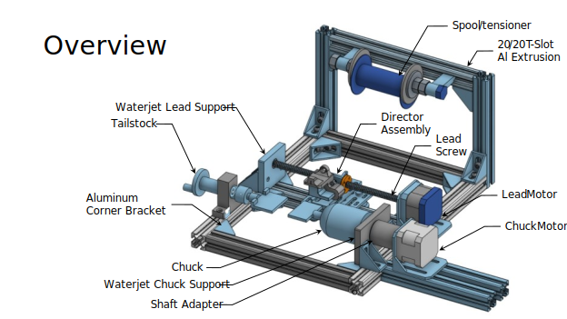
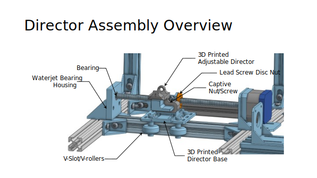
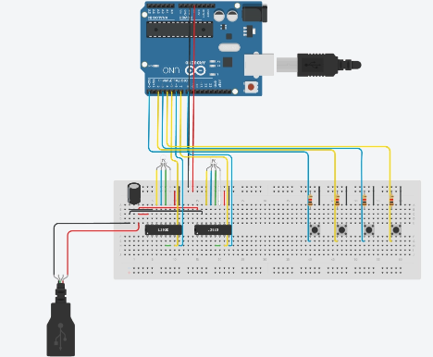
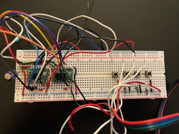
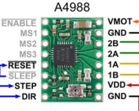

# Solenoid Winding Machine - Standard Operating Procedure (SOP)
*Last revised: 7th June 2026 by Thomas Frew*

## Overview
*(Refer to CAD overviews of the winder and director assemblies)*

## Winding Instructions

### Wiring and Setup
Ensure the breadboard, solenoid winder motors, and Arduino Uno are wired as shown in the reference diagrams.
- Make all I/O connections shown in the table below. 
- Regarding the breadboard, buttons are LEFT, RIGHT, ENTER, BACK, from left to right.
- The motor controller board with the larger heatsink must be connected to the chuck motor*.

*Stepper motor connected to chuck: pins 1&3 are coil A and 4&6 are coil B. Stepper motor for lead screw: pins 1&4 are coil A and 3&6 are coil B.

### I/O Connections Table

| Input | Arduino Connection |
| :--- | :--- |
| Left_button | Digital Pin 0 |
| Right_button | Digital Pin 2 |
| Back_button | Digital Pin 3 |
| Enter_button | Digital Pin 4 |
| Lead_STEP | Digital Pin 5 |
| Lead_DIR | Digital Pin 6 |
| Chuck_STEP | Digital Pin 7 |
| Chuck_DIR | Digital Pin 8 |
| Lead_MS1 | Digital Pin 9 |
| Lead_MS2 | Digital Pin 10 |
| Lead_MS3 | Digital Pin 11 |
| +ve breadboard rail | +5V |
| -ve breadboard rail | GND |

### Step-by-Step Operation

1. Go to [https://github.com/Thoamy/SolenoidWinder](https://github.com/Thoamy/SolenoidWinder) and download `SolenoidWindingMachine_V1.ino`.
2. You will need the Arduino IDE to load the project onto your Arduino.
3. Ensure you have the correctly sized Chuck Adapter and Tailstock Adapter to match your Solenoid Housing.
4. Insert the Chuck Adapter and Tailstock Adapter into the Solenoid Housing (Chuck Adapter on the side with the coil escape hole), then install the assembly into the chuck/tailstock.
5. **Note on 3D Printing:** If you need to 3D print new adapters, ensure the Chuck adapter is printed oriented in a horizontal position (the position used) for torque transfer, and the Tailstock Adapter is printed in the vertical position for axial load bearing.
6. Load your roll of copper onto the Spool Holder subassembly. Use two nuts to hold the roll on, but do not tension the roll.
7. If necessary, loosen the captive nut on the Director Assembly and adjust the Director to be as close to the solenoid as possible, ensuring that the solenoid will never collide with the Director Assembly during rotation.
8. Feed the copper through the Director large hole, through 2-3 layers of foam, then through the Director small hole.
9. Use pliers to feed the copper through the escape hole of the Solenoid Housing.
10. Plug the Arduino USB into your computer (load the program if not done), and plug the 12V wall adapter barrel jack into the barrel jack adapter (plugged into the breadboard).
    - **⚠️ WARNING: DO NOT MIX +5V AND +12V OR YOU WILL FRY YOUR ARDUINO.**
11. During winding, make sure the first layer is super tight (slide the coils down with your hands if needed) so that the subsequent layers stack nicely on top.

## Controls
- **Left:** Moves left while rotating chuck.
- **Right:** Moves right while rotating chuck.
- **Enter + Right/Left (Hold):** Disengages the chuck and moves left/right.
- *Note:* If you need to unwind (or manually spin the motor for any reason), **turn off power and then unplug the motor first**.

## Troubleshooting
- **The motor is going the wrong way:** Swap a set of A/B lines on the breadboard (either 1 or 2, not both).
- **The chuck is jerking in different directions:** One of the coil lines has likely become unplugged from the breadboard.
- **The copper crossed over itself:** Turn off power, unplug the motor, unwind, plug back in, and try again.
